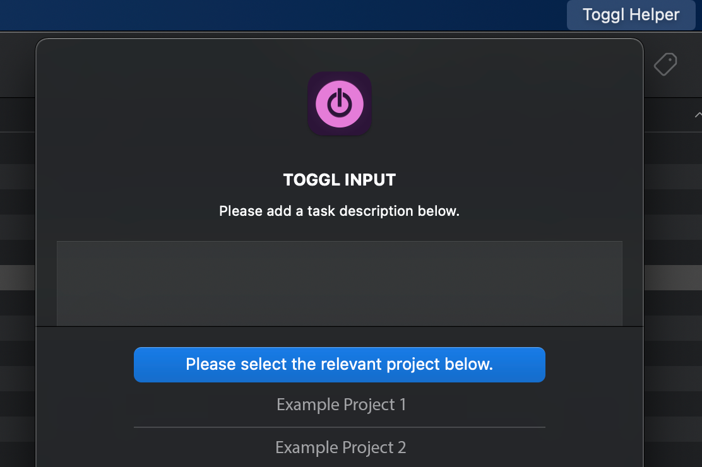

# TOGGL HELPER

## A simple Python tool to track your toggl projects in macOS.

### Install requirements

From the project root, install requirements as follows

```
python -m pip install -r requirements.txt
```

### Toggl API token

In order to work, Toggl Helper requires you to store the API token in your laptop. You can find the key at the 
following link: https://track.toggl.com/profile

Scroll to the bottom of the page, under the API token section click on Click to reveal and copy the token displayed.
Now that you have the key, launch the app as follows

```
python toggl_helper.py
```

When you launch the program for the first time, a prompt will come up. Here you can paste the API key (the paste 
shortcut might not work, however you can right-click and select paste)

### 1 tool - 2 ways



With Toggle Helper you can track your Toggl projects in 2 different ways: either by adding your projects in the menu 
bar app or through an Excel file.

After having launched the app, you will find a menu by clicking on the Toggl Helper app in the menu bar at the top of 
the screen. If you only want to use the Excel functionality, you can click on *Create Empty Excel*, and you will find it 
on your desktop. If you want ot use the menu bar app, you can click on *Start Tracking* and on *Stop Tracking* when you
are done. All the tasks that you add in this mode, will end up automatically in the Excel file on your desktop.

Regardless of which way you choose, before syncing Toggl, always double-check the contents of the 
Excel on your desktop. Make changes where necessary and once you are happy with it, click on *Sync Toggl*.
If you check you Toggl, you will now see that all the contents of the Excel file have been updated. 

If you get a warning popup, click over this 
[link](https://support.apple.com/en-gb/HT202491#:~:text=go%20to%20security%20%26%20privacy.%20click%20the%20open%20anyway%20button%20in%20the%20general%20pane%20to%20confirm%20your%20intent%20to%20open%20or%20install%20the%20app.%20) 
to see how to authorise the app.
